# Banc d’essai LoRa : Federated Learning IoT (version mini-station météo)

[](firmware/gateway_uno/gateway_uno.ino)
[](https://www.espressif.com/)
[](firmware/gateway_uno/gateway_uno.ino)
[](docs/LORA.md)
[](docs/HARDWARE.md)
[](backend/app/main.py)
[](backend/)
[](database/schema.sql)
[](frontend/)
[](docker/docker-compose.yml)
[]()
[](docs/ARCHITECTURE.md)
[](LICENSE)

Prototype pédagogique. Deux nœuds ESP32 distants (capteur DHT11 et radio LoRa RA-02) communiquent avec une gateway Arduino Uno. Un PC, placé entre la radio et le serveur, transmet les paquets vers le backend que chacun déploie. Le dashboard permet de vérifier que la liaison radio fonctionne réellement.

**État actuel du code.** La chaîne de communication (**v1**) est opérationnelle. Les nœuds entraînent **localement** un régresseur linéaire minuscule et envoient les poids par LoRa (table `fl_updates`). L’**agrégation FedAvg** (moyenne pondérée des modèles et renvoi du modèle global en LoRa) est exécutée par l’API (`fl_rounds`, vue dashboard `#rounds`).

Il n’existe pas d’instance publique maintenue en continu. Chaque personne déploie le serveur chez elle (Docker en local, VPS ou nom de domaine personnel) et peut l’arrêter à tout moment.

## Objectifs du projet

Trois niveaux, dans cet ordre.

**1. Apprendre la chaîne IoT sur du matériel réel.**  
Câbler, alimenter, flasher, lire un capteur, établir un lien LoRa. Cette étape forme à l’embarqué, à l’électronique de laboratoire, et aux contraintes d’un réseau longue portée et bas débit : spreading factor, RSSI, SNR, paquets perdus ou illisibles. Le canal n’est pas simulé : il est physique.

**2. Partager un banc reproductible.**  
Le firmware, le câblage et le dashboard sont documentés pour qu’une autre personne puisse refaire le montage **avec son matériel et son serveur**. Licence MIT. L’intérêt n’est pas un site d’auteur accessible en permanence, mais la possibilité de reproduire l’expérience.

**3. Poser l’instrument pour le Federated Learning.**  
Lorsque la radio et l’ingestion sont stables, le même banc sert à l’apprentissage fédéré : entraînement local sur les nœuds, puis agrégation de type FedAvg (McMahan et al., 2017), comparaison synchrone / asynchrone, et mesure de l’effet du réseau LoRa sur le modèle (pertes, latence, nœuds absents). Sans la couche de communication, les expériences FL ne pourraient pas relier leurs résultats au canal radio.

## Prérequis

### Matériel utilisé

<table>
  <tr>
    <td align="center" width="25%">
      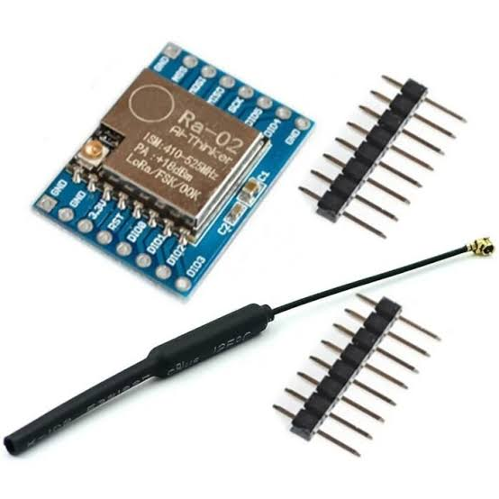
      <br /><sub><b>LoRa</b> RA-02 (SX1278, 433 MHz)</sub>
    </td>
    <td align="center" width="25%">
      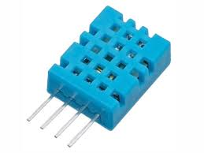
      <br /><sub><b>Capteur</b> DHT11</sub>
    </td>
    <td align="center" width="25%">
      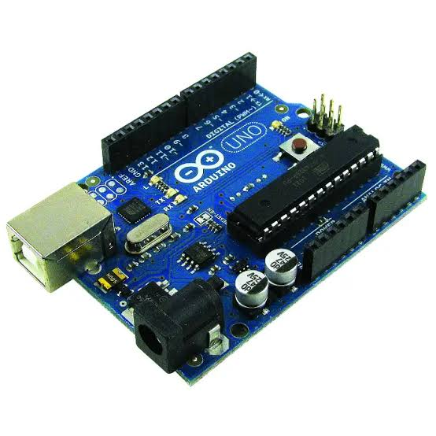
      <br /><sub><b>Gateway</b> Arduino Uno</sub>
    </td>
    <td align="center" width="25%">
      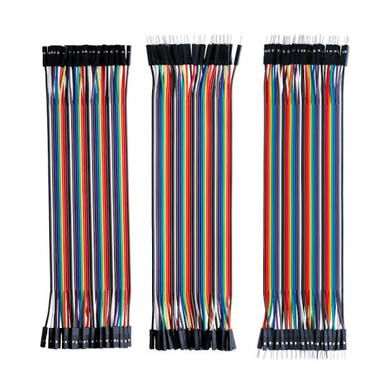
      <br /><sub><b>Fils</b> Dupont M-M, M-F, F-F</sub>
    </td>
  </tr>
  <tr>
    <td align="center" width="25%">
      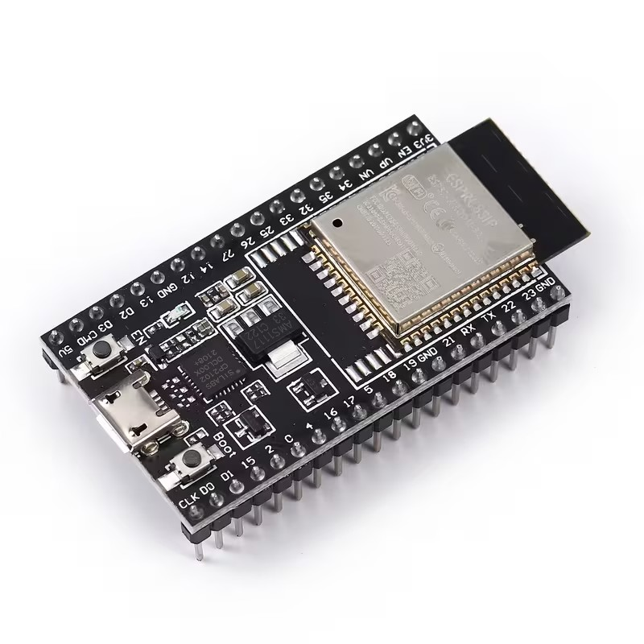
      <br /><sub><b>Nœud 1</b> ESP32 WROOM-32D</sub>
    </td>
    <td align="center" width="25%">
      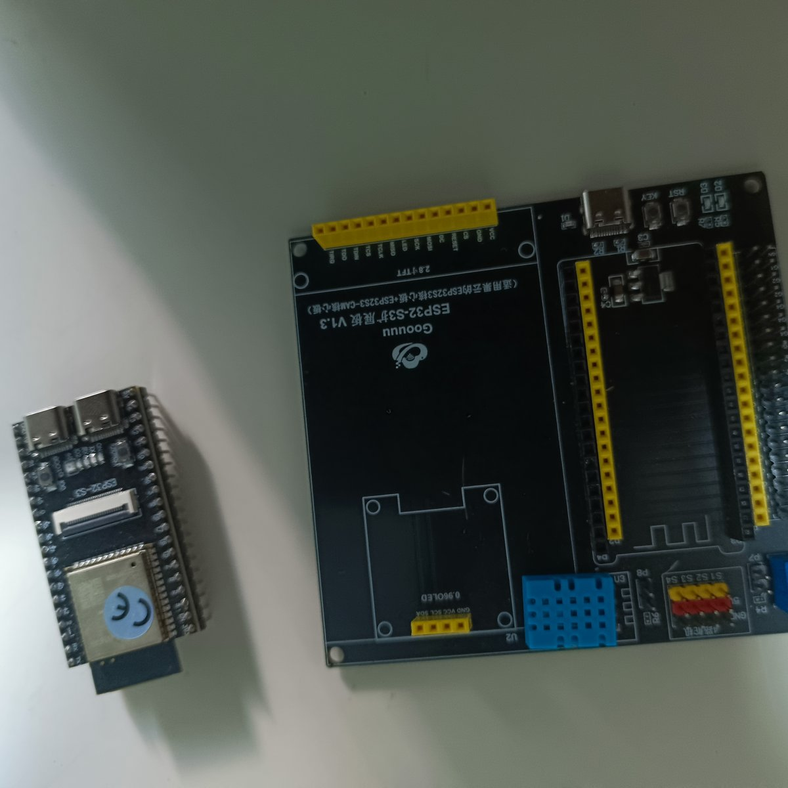
      <br /><sub><b>Nœud 2</b> ESP32-S3-CAM + extension</sub>
    </td>
    <td align="center" colspan="2">
      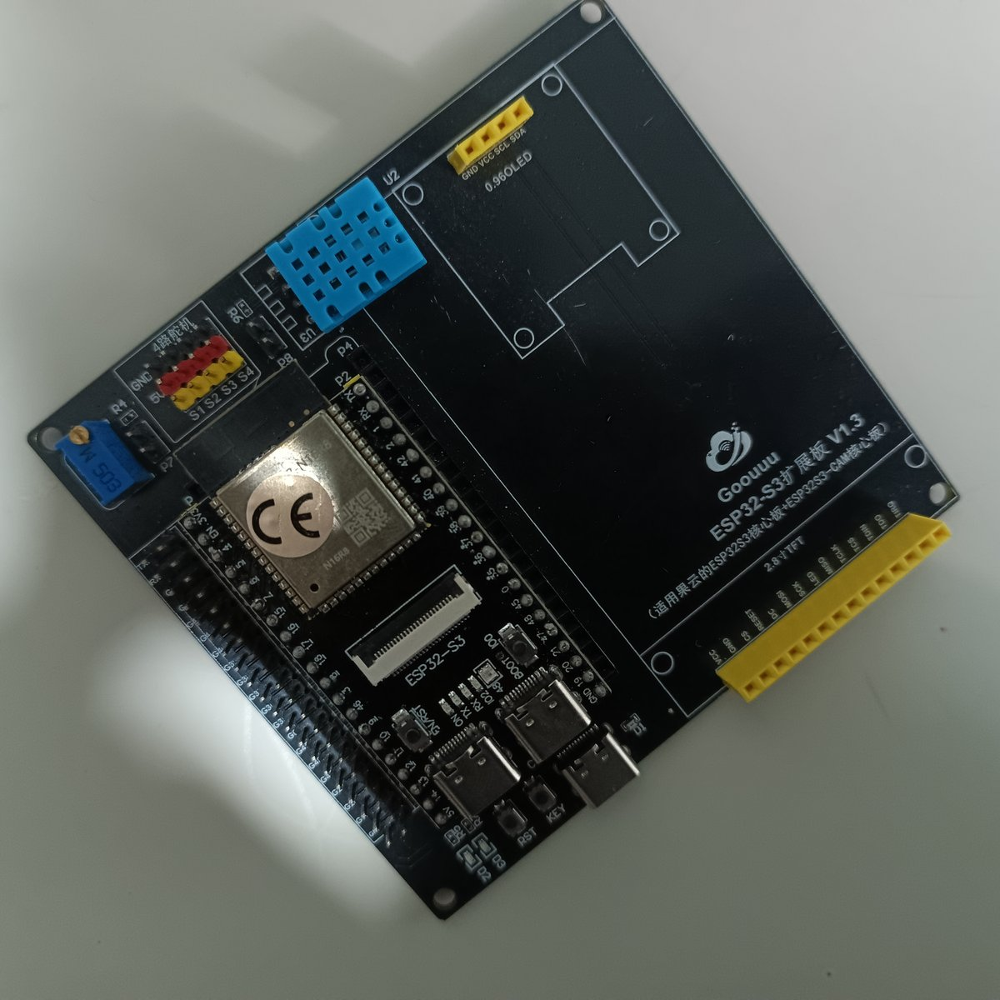
      <br /><sub><b>Nœud 2</b> S3-CAM clipsé, DHT11 déjà soudé</sub>
    </td>
  </tr>
</table>

| Élément | Remarque |
|---------|----------|
| ESP32 WROOM-32D | Nœud 1, DHT11 externe |
| ESP32-S3 (+ carte d’extension) | Nœud 2, DHT11 déjà soudé (GPIO 2) |
| 3 × RA-02 (SX1278, 433 MHz) | Antenne IPEX, **3.3 V uniquement** |
| Arduino Uno | Gateway USB, convertisseur 5 V / 3.3 V obligatoire |
| DHT11 | Nœud WROOM (le S3 a le sien sur l’extension) |
| Jumpers M-M, M-F, F-F | Code couleur : [docs/HARDWARE.md](docs/HARDWARE.md) |
| PC + serveur | Agent série sur le PC. API et dashboard en local ou sur un VPS personnel |

RA-02 : huit broches utilisées (3.3V, GND, NSS, SCK, MOSI, MISO, RST, DIO0). DIO1 à DIO5 restent non connectées. L’antenne IPEX doit être en place **avant** la première transmission.

### Logiciel

| Outil | Usage |
|-------|--------|
| Arduino IDE 2.x | ESP32 Dev Module, ESP32-S3, Arduino Uno |
| LoRa (Sandeep Mistry) + DHT Adafruit | Firmware nœuds / gateway |
| Python 3 | `agent/serial_bridge.py`, API FastAPI |
| Docker Compose | Postgres, API, nginx, front |

### Vocabulaire

Les termes ci-dessous reviennent dans le firmware, le JSON de la gateway et le dashboard. Ils sont expliqués ici une fois, pour la suite du texte.

| Terme | Signification |
|-------|----------------|
| **LoRa** | Modulation radio longue portée, bas débit. Ici : 433 MHz, module RA-02 (puce SX1278). |
| **RSSI** | *Received Signal Strength Indicator*. Puissance du signal **reçu** par la gateway, en **dBm**. Une valeur proche de 0 (par exemple −40 dBm) indique un signal fort ; −100 dBm indique un signal très faible. |
| **SNR** | *Signal-to-Noise Ratio*. Rapport entre le signal utile et le bruit, en **dB**. Plus il est élevé, plus le paquet est facile à décoder. |
| **dBm / dB** | Le **dBm** mesure une puissance (référence : 1 mW). Le **dB** mesure un rapport, comme le SNR. |
| **SF** | *Spreading factor* (facteur d’étalement). Ici **SF7** : débit plus élevé, portée de laboratoire suffisante. Un SF plus grand allonge la portée et ralentit l’émission. |
| **BW / CR** | **BW** : bande passante radio (ici 125 kHz). **CR** : *coding rate*, redondance du code correcteur (ici 4/5). |
| **`seq`** | Compteur de séquence : entier incrémenté à chaque envoi du nœud. Un saut (1, 2, puis 4) signale un paquet perdu. |
| **`ok`** | Champ JSON émis par la gateway. `true` : le **checksum** du paquet LoRa est valide, le contenu est cohérent. `false` : le paquet a été reçu, mais son contenu n’est pas fiable. |
| **checksum** | Contrôle d’intégrité (XOR des octets du paquet). La gateway compare la valeur reçue à celle qu’elle recalcule, puis renseigne `ok`. |
| **`bad_header`** | En-tête illisible (octet magique ou numéro de version invalides). Souvent lié à un RSSI trop faible pour un décodage correct. Enregistré avec `node_id` 0 : paquet **corrompu**, pas un trou de `seq`. |
| **`node_id`** | Identifiant du nœud émetteur (1 = WROOM-32D, 2 = ESP32-S3). La valeur 0 est réservée aux paquets corrompus. |
| **uptime** | Temps écoulé depuis le dernier démarrage du nœud, en secondes. Une chute brutale indique un redémarrage. |
| **SPI** | Bus série entre le microcontrôleur et le RA-02. Lignes : **NSS** (sélection de la puce), **SCK** (horloge), **MOSI** / **MISO** (données). |
| **DIO0** | Broche d’interruption du RA-02 : signale qu’un paquet est arrivé ou que l’émission est terminée. |
| **GPIO** | Broche d’entrée/sortie programmable d’un ESP32 (numérotée, par exemple GPIO 5). |
| **Gateway** | Ici : l’Arduino Uno. Elle reçoit les paquets LoRa, ajoute RSSI et SNR, et envoie une ligne JSON vers le PC. |
| **FedAvg** | *Federated Averaging* (McMahan et al., 2017) : moyenne pondérée des poids locaux. Formule et statut : section ci-dessous. |
| **POC** | *Proof of concept* : maquette destinée à démontrer que la chaîne fonctionne, pas un produit fini. |

Le détail radio (format des 14 octets, SF / BW / CR) est dans [docs/LORA.md](docs/LORA.md).

## Pourquoi ce montage

Il serait plus simple d’envoyer les mesures en Wi-Fi ou en 4G depuis chaque ESP32 vers le cloud. Ce choix ne permettrait pas de mesurer le **canal LoRa réel**, qui est l’objet de l’expérience (RSSI, SNR, trous de `seq`, paquets illisibles).

Un VPS n’a pas d’antenne RA-02. Si les nœuds publiaient directement en HTTP, on ne pourrait plus observer la radio. Le PC et l’Uno au milieu ne sont pas un détour : c’est l’instrument de mesure.

Un banc limité au Serial Monitor reste difficile à relire et à partager. D’où les quatre couches :

| Couche | Rôle | Ici |
|--------|------|-----|
| **1. Physique** | Capteurs, MCU, alimentation, fils | DHT11, ESP32, RA-02, Uno, convertisseur de niveaux |
| **2. Communication** | Transport objet → laboratoire | LoRa 433 MHz, USB 115200, HTTP POST |
| **3. Plateforme** | Stockage | FastAPI, PostgreSQL (`readings`, `node_stats`, `fl_updates`, `fl_rounds`) |
| **4. Application** | Preuve que la chaîne fonctionne | Dashboard React (liaison et rounds), flux WebSocket |

## Méthodologie

| Phase | Objectif | Statut |
|-------|----------|--------|
| **v1** | Prouver ESP32 → LoRa → Uno → PC → site | **Réalisée** (dashboard comms) |
| **v2a** | Entraînement local + transport des poids sur LoRa | **Réalisée** (table `fl_updates`) |
| **v2b** | FedAvg synchrone : moyenne serveur + modèle global renvoyé | **Réalisée** (`fl_rounds`, vue `#rounds`) |
| **v3** | Pertes, latence, RSSI dans le temps (métriques de thèse) | Plus tard |

FedAvg **synchrone** : le serveur envoie un signal de début de round, et les nœuds qui participent s’entraînent dans la même fenêtre. Ce mode est plus simple à déboguer. L’asynchrone (chaque nœud envoie selon sa radio) est plus réaliste en LoRa ; il est prévu après le FedAvg sync.

Capture en continu (DHT toutes les 15 s, tampon local de 32 échantillons). L’entraînement local (SGD) tourne sur ce tampon. L’agrégation fédérée a lieu **lorsque** un round est clos côté serveur (`POST /api/fl/rounds`, timeout 90 s). Un nœud absent n’entre pas dans la somme.

## Apprentissage fédéré et FedAvg

Le Federated Learning vise à entraîner un modèle **sans centraliser les données brutes**. Chaque client \(k\) minimise une perte locale \(F_k\) sur son jeu \(D_k\) (ici : mesures DHT11 qui **restent sur l’ESP32**). Seuls les **paramètres** circulent.

L’algorithme retenu est **Federated Averaging** (FedAvg), introduit par McMahan, Moore, Ramage, Hampson et y Arcas (2017) dans *Communication-Efficient Learning of Deep Networks from Decentralized Data* (AISTATS, PMLR 54). Après un round \(t\), le serveur forme le modèle global par **moyenne pondérée** par la taille des jeux locaux \(n_k = |D_k|\) :

$$
w_{t+1} \;\leftarrow\; \sum_{k=1}^{K} \frac{n_k}{n}\, w_{t+1}^{(k)}
\quad\text{avec}\quad
n = \sum_{k=1}^{K} n_k .
$$

\(K = 2\) sur ce banc. Un nœud absent (timeout LoRa) n’entre pas dans la somme : c’est précisément le cas expérimental du client en bord de couverture.

### Modèle embarqué (déjà en firmware)

Régresseur linéaire, quatre coefficients. On prédit la température au pas suivant à partir des deux températures précédentes et de l’humidité précédente (entrées normalisées \(T/50\), \(H/100\)) :

$$
\frac{\hat{T}_t}{50}
=
w_0\,\frac{T_{t-1}}{50}
+ w_1\,\frac{T_{t-2}}{50}
+ w_2\,\frac{H_{t-1}}{100}
+ w_3 .
$$

Le vecteur \(w = (w_0,w_1,w_2,w_3)\) part en LoRa (27 octets avec `round_id` ; la forme 25 octets reste acceptée). **FedAvg moyenne ces quatre composantes** entre nœuds, puis renvoie \(w_{\text{global}}\) en downlink LoRa. Côté API : `POST /api/fl/rounds` et table `fl_rounds`. Vue dashboard : `#rounds`.

### Déroulement d’un round

Le round est **piloté par le serveur**, ce qui rend le timing reproductible :

1. Ouverture d’un round côté API (`POST /api/fl/rounds`), qui met en file une commande `start_round`.
2. L’agent PC lit cette commande et l’écrit sur le port série ; la gateway l’émet en LoRa (paquet 8 octets). La commande est **retransmise toutes les ~2,5 s** : à 400 ms, la gateway s’entendait elle-même et enregistrait des `bad_header`.
3. Le nœud qui entend le signal note le `round_id`, entraîne son modèle sur son tampon, et renvoie ses quatre poids (27 octets). Les nœuds **écoutent en continu** : une fenêtre de 400 ms après chaque envoi capteur laissait passer la plupart des `start_round`.
4. Dès que **deux nœuds distincts** ont répondu, ou au **timeout de 90 s**, le serveur calcule la moyenne pondérée, l’enregistre dans `fl_rounds` et la diffuse (paquet 25 octets, type `0x30`).
5. Chaque nœud qui reçoit \(w_{\text{global}}\) **remplace** son vecteur local et poursuit son SGD à partir de là.

Les poids envoyés hors round (`round_id = 0`, émission périodique de la v2) sont stockés mais **exclus** de l’agrégation.

Pour constituer un échantillon, le serveur sait aussi enchaîner les rounds seul, à intervalle réglable depuis la vue `#rounds`. Le rythme mérite attention plutôt qu’un maximum : le tampon d’un nœud met **8 minutes** à se renouveler (32 échantillons à 15 s), si bien que des rounds trop rapprochés réapprennent les mêmes données. Et chaque clôture déclenche un downlink pendant lequel la gateway émet, donc perd des paquets capteur — précisément ceux qui servent ensuite à mesurer l’erreur des modèles. Un grand nombre de rounds s’obtient par une session longue, pas par une cadence rapide.

## Première campagne (matériel réel)

Deux pièces, même gateway Uno. Nœud 1 (WROOM-32D) près de la gateway (lien témoin). Nœud 2 (ESP32-S3) plus loin (lien dégradé, climat distinct). LoRa 433 MHz, SF7, BW 125 kHz. Données lues sur le Postgres du déploiement personnel (29 août 2026) :

| Nœud | Lectures capteur | Poids reçus | RSSI moyen | SNR moyen | T moy. | Hum. moy. |
|------|------------------|-------------|------------|-----------|--------|-----------|
| 1 | 995 | 197 | −62,3 dBm | 9,77 dB | 24,9 °C | 63,1 % |
| 2 | 1082 | 195 | −83,9 dBm | 3,78 dB | 28,6 °C | 54,8 % |

Un seul `bad_header` (`node_id` 0). En phase « pièce distante », le nœud 2 a été observé vers **−100 dBm** avec un SNR parfois **négatif**, tout en restant décodable (`ok = true`). Les deux vecteurs \(w\) locaux divergent : chaque nœud apprend **sa** distribution locale (données non i.i.d.). C’est le régime pour lequel FedAvg est conçu.

Le nœud proche n’est **pas** un défaut : c’est le client qui répond de façon fiable. Le nœud loin teste la fédération sous contrainte radio.

### Pertes : ce qui vient de la radio et ce qui n’en vient pas

Sur une session de ~2 h 37 avec le nœud 2 en pièce distante, le contraste se durcit : nœud 1 à **−68,7 dBm** et **+9,52 dB** de SNR ; nœud 2 à **−100,7 dBm** et **−5,11 dB**, avec un SNR **négatif sur 95 %** de ses paquets, presque tous décodés (`ok = true`). Un SNR négatif n’est donc pas synonyme de paquet perdu.

Trois précautions de lecture, tirées de cette session :

| Observation | Interprétation |
|-------------|----------------|
| Trou de `seq` **simultané** sur les deux nœuds (~11 min) | Ce n’est pas la radio. Un fading LoRa ne coupe pas deux nœuds à la même seconde : c’est l’agent, le PC ou le serveur. |
| Taux de perte affiché ~99 % après un reflash | Artefact : `seq` repart de zéro et le calcul compte un **repli de compteur** (~65 000 paquets « manquants »). |
| Perte réelle, hors trou commun | **~1 %** pour le nœud témoin, **~12 %** pour le nœud distant, surtout des pertes isolées d’un paquet. |

Ce sont ces ~1 % et ~12 % qui décrivent le canal, pas les compteurs bruts du dashboard.

## Résultats de l’agrégation fédérée

Session de **19 rounds** sur le banc décrit (nœud 1 témoin, nœud 2 en pièce distante). Séries brutes : `results/`.

| Round clos avec | Nombre | Durée observée |
|-----------------|--------|----------------|
| Les **deux** nœuds | 12 | ~42 à 77 s (souvent ~50 s) |
| **Un seul** nœud | 6 | 90 s (timeout) |
| Aucun nœud | 1 (mise au point) | 90 s |

Un round à deux participants ne va donc pas au bout du timeout : il se ferme dès la seconde mise à jour reçue. Le déroulement complet est filmé dans la [section Démo](#démo).

Les cinq premiers rounds relèvent de la mise au point de l’écoute downlink ; la comparaison témoin / dégradé se lit à partir du sixième.

### Cas 1 : les deux clients entrent dans la moyenne

Le nœud distant est mesuré entre **−105 et −109 dBm** avec un SNR **négatif**, et ses poids arrivent quand même. Le témoin reste à ~ **−80 à −93 dBm**, SNR ~ **+10 dB**. Les deux tampons sont pleins (\(n_k = 32\)), donc la moyenne est équipondérée.

Exemple de round complet, vecteurs \(w = (w_0, w_1, w_2, w_3)\) :

| Origine | \(w_0\) | \(w_1\) | \(w_2\) | \(w_3\) | Lien |
|---------|---------|---------|---------|---------|------|
| Nœud 1 (témoin) | 0,6309 | 0,0575 | 0,0635 | 0,1042 | −80 dBm, +10,0 dB |
| Nœud 2 (distant) | 0,6330 | 0,0660 | 0,0778 | 0,1219 | −105 dBm, −3,5 dB |
| **Modèle global** | **0,6348** | **0,0613** | **0,0701** | **0,1118** | diffusé aux deux |

Chaque composante du modèle global tombe **entre** les deux vecteurs locaux : c’est bien une moyenne, pas une recopie du client le mieux reçu. L’écart entre les deux clients est systématique et non nul, parce que leurs distributions locales diffèrent (données non i.i.d.) :

| Round | \(w_1\) nœud 1 | \(w_1\) nœud 2 | \(w_1\) global | Écart entre clients |
|-------|----------------|----------------|----------------|---------------------|
| 6 | 0,0537 | 0,0642 | 0,0584 | 0,0105 |
| 7 | 0,0540 | 0,0614 | 0,0584 | 0,0074 |
| 8 | 0,0540 | 0,0610 | 0,0575 | 0,0070 |
| 9 | 0,0536 | 0,0607 | 0,0571 | 0,0071 |
| 16 | 0,0552 | 0,0647 | 0,0599 | 0,0095 |
| 19 | 0,0575 | 0,0660 | 0,0613 | 0,0085 |

Le poids sur l’humidité (\(w_2\)) est celui qui sépare le plus les deux clients (~0,064 contre ~0,078) : le nœud 2 relève une température plus élevée et une humidité plus basse, et son modèle en tient compte davantage. C’est exactement l’hétérogénéité que FedAvg doit absorber. Son origine — les capteurs plutôt que les pièces — est établie plus loin, par [échange des rôles](#contrôle-par-échange-des-rôles).

### Cas 2 : le client distant est exclu du round

Trois rounds se sont clos au timeout avec un seul participant. Le modèle global **reste défini** : il vaut alors le vecteur du témoin, sans interpolation ni valeur par défaut pour le client manquant.

| Round | Participants | Modèle global | Ce qui est arrivé au nœud 2 |
|-------|--------------|---------------|------------------------------|
| 10 | nœud 1 seul | \(w_1 = 0{,}0532\) (= témoin) | poids reçus **après** la clôture, à −108 dBm |
| 11 | nœud 1 seul | \(w_1 = 0{,}0532\) | aucun poids pour ce round |
| 14 | nœud 1 seul | \(w_1 = 0{,}0541\) | aucun poids pour ce round |

Le round 10 est le plus instructif : le client distant n’était pas hors service, il était **hors délai**. Ses paquets figurent dans `fl_updates` avec le bon `round_id`, mais après `closed_at`, donc hors de la somme. La distinction « client injoignable » / « client trop lent » est ainsi tracée, ce qu’un FedAvg simulé ne permettrait pas.

### Ce que vaut le modèle produit

Comparer des vecteurs de poids ne dit pas si le modèle **prédit** bien. Chaque \(w\) a donc été rejoué sur les températures réellement mesurées dans les quinze minutes **suivant** la clôture du round, puis comparé à la prédiction triviale dite de persistance — annoncer que la température ne changera pas. Un triplet de lectures n’est retenu que si ses `seq` se suivent : un paquet perdu l’écarte de l’évaluation.

Erreur quadratique moyenne, en degrés Celsius :

| Nœud | Persistance | Son modèle local | Global **s’il a participé** | Global **s’il était absent** |
|------|-------------|------------------|------------------------------|-------------------------------|
| 1 (témoin) | 0,028 | 0,034 | 0,750 | 2,296 |
| 2 (distant) | 0,380 | 0,353 | 0,865 | 1,467 |

**Le client exclu repart avec un modèle qui lui va mal.** C’est le lien le plus direct entre la radio et l’apprentissage. Quand le nœud 2 rate le round, le modèle qu’on lui redescend est **1,7 fois** moins précis que lorsqu’il a été agrégé. La situation est symétrique : au round 2, seul le nœud 2 avait répondu, et le modèle qui en découle atteint 2,3 °C d’erreur pour le nœud 1. Un timeout LoRa ne retire donc pas seulement un client d’une moyenne — il lui renvoie un modèle calibré sur la pièce d’en face. Le chiffre du nœud 2 repose sur quatre rounds, celui du nœud 1 sur un seul : l’ordre de grandeur tient, la valeur exacte demande confirmation.

**Le modèle global est moins précis que chaque modèle local, dans 27 comparaisons sur 28.** Ce n’est pas un défaut d’agrégation mais l’effet attendu de l’hétérogénéité : les deux clients ne relèvent ni la même température ni la même humidité, et la moyenne produit un compromis systématiquement biaisé — d’environ 0,85 °C de surestimation pour le témoin. C’est le *client drift* du FL non i.i.d., ici mesuré sur du matériel plutôt que simulé.

**Sur ces séries, la persistance bat le régresseur appris.** Un modèle à quatre poids n’apporte alors aucun gain de précision : la température varie moins que la résolution du capteur sur un pas de quinze secondes. Cette conclusion est cependant liée aux conditions de la session — un régime nocturne où le signal bougeait à peine — et la [session d’échange des rôles](#contrôle-par-échange-des-rôles) la renverse sur un signal plus dynamique.

Ces trois grandeurs sont calculées en direct par le dashboard, dans le panneau **Erreur du modèle** de la vue `#rounds` : le tableau par nœud, et une courbe du RMSE round par round où un marqueur creux signale un nœud absent de la moyenne. Le même calcul est reproductible hors ligne sur les exports (`results/campagne-2026-09-04-v3/erreur.py`).

### Ce que la session établit

- Un lien à **SNR négatif** (−105 à −109 dBm) transporte encore des mises à jour de modèle : la contrainte radio ne supprime pas la participation, elle la rend intermittente. Sur les 18 rounds où au moins un client a répondu, les **deux** clients ont été agrégés **12 fois**.
- Quand il participe, la moyenne pondérée déplace réellement le modèle global vers son climat ; quand il dépasse le délai, le round **aboutit quand même** avec un client de moins.
- Un round qui aboutit n’est pas pour autant un round sans conséquence : le client exclu reçoit un modèle **1,7 fois moins précis** pour lui. La dégradation radio se propage jusqu’à la qualité du modèle, et pas seulement jusqu’au taux de participation.
- Le pilotage synchrone a un coût mesurable : la gateway est en émission pendant la diffusion du modèle global, et quelques paquets capteur manquent alors par half-duplex. C’est une perte imputable au **protocole**, pas au canal.
- La limite du banc est assumée : le modèle global reste moins précis que les modèles locaux. Ce qui est démontré, c’est la mécanique fédérée sous contrainte radio.

## Contrôle par échange des rôles

Une session à un seul placement laisse ouverte une explication concurrente : le modèle du nœud éloigné pouvait être mauvais **en soi**, indépendamment de la radio. Pour trancher, les deux nœuds ont échangé de pièce et leurs puissances d’émission ont été égalisées à 14 dBm, de sorte que **seule la position distingue les clients**. Session de 40 rounds enchaînés automatiquement, 1200 triplets exploitables contre 319 précédemment. Rapport détaillé : [docs/v3/V3_Session_inversion.md](docs/v3/V3_Session_inversion.md).

| Nœud | Persistance | Son modèle local | Global **s’il a participé** | Global **s’il était absent** | Pénalité |
|------|-------------|------------------|------------------------------|-------------------------------|----------|
| 1 (éloigné) | 0,039 | 0,036 | 0,539 | 1,042 | **×1,8 à 1,9** |
| 2 (proche) | 0,410 | 0,352 | 0,539 | 0,990 | **×1,8** |

**La dégradation suit le lien, pas le nœud.** Le facteur mesuré était de 1,7 quand le nœud 2 occupait la pièce éloignée ; rôles échangés, on retrouve 1,8 à 1,9 sur le nœud 1. Le phénomène a changé de matériel en même temps que de pièce : il est attaché à la qualité de la liaison, et l’explication concurrente tombe. Le résultat n’est pas un artefact de période — comparée à ses rounds voisins immédiats plutôt qu’à la moyenne de session, chaque absence donne encore un rapport de 1,8 à 2,3.

Deux réserves sur l’amplitude. À **deux** clients, l’exclusion d’un nœud laisse l’autre seul à définir le modèle global : ce qui est mesuré est donc le pire cas, « recevoir le modèle de l’autre pièce », et non une valeur générale de FedAvg. Et le RMSE rejoue un vecteur *gelé*, alors que le nœud, qui adopte réellement les poids reçus, se recale ensuite par SGD sur ses propres données. La pénalité est un plafond, pas un coût permanent.

**Le régresseur bat la persistance, à condition que le signal bouge.** Le gain est de 14 % sur le nœud 2 (0,352 contre 0,410). Sur le nœud 1, il ne vaut que trois millièmes de degré, sous le seuil de signification physique d’un DHT11. La conclusion nocturne précédente est donc corrigée, mais sans généralisation abusive.

### Le RSSI moyen ne mesure pas la fiabilité du lien

| Nœud | RSSI s’il participe | RSSI s’il est absent | Réception s’il participe | Réception s’il est absent |
|------|---------------------|----------------------|--------------------------|---------------------------|
| 1 | −95,8 dBm | −97,5 dBm | 96 % | 50 % |
| 2 | −52,2 dBm | −46,2 dBm | 93 % | 83 % |

Le niveau de signal n’explique pas l’exclusion : 1,7 dB d’écart sur le nœud 1, et un écart de **signe contraire** sur le nœud 2. La raison est un biais du survivant — le RSSI n’existe que pour les paquets reçus, et quand le lien lâche il n’arrive pas un paquet faible, il n’arrive rien. Le niveau moyen ne décrit donc que les paquets qui ont réussi. C’est un enseignement qu’une simulation, où les pertes sont connues, ne produit pas ; il justifie d’historiser le **taux de réception** et non le seul RSSI.

### L’hétérogénéité vient des capteurs, pas des pièces

L’échange constitue une expérience de contrôle involontaire. Les pièces ont été inversées ; l’écart d’environ 4 °C entre les deux nœuds ne l’a pas été, et le nœud 2 est même devenu légèrement plus chaud en rejoignant la pièce censée être la plus fraîche. Quatre mesures suffisent à séparer les causes :

| Cause | Contribution |
|-------|--------------|
| Écart de calibration entre les deux DHT11 | **4,2 °C** |
| Heure de la journée | **+0,9 °C**, sur les deux nœuds à la fois |
| Différence réelle entre les deux pièces | **0,1 °C** |

L’heure n’explique que le décalage **commun** aux deux nœuds, qui ne modifie pas l’écart entre eux. Il n’y a donc pas deux microclimats mais deux capteurs mal accordés, ce qu’autorise largement leur tolérance de ±2 °C par exemplaire.

Cela n’affaiblit pas le dispositif : les distributions locales restent différentes, FedAvg y est bien confronté et le *client drift* mesuré est réel. Seule la cause change — et l’on peut soutenir qu’elle est plus représentative, car dans un parc IoT déployé des capteurs bon marché dérivent chacun de leur côté.

### Ce qui n’est pas encore mesuré

La variation contrôlée du spreading factor, le mode asynchrone, et le passage à un nombre de clients supérieur à deux — ce dernier point étant nécessaire pour savoir ce que devient la pénalité quand la moyenne ne repose plus sur un seul survivant.

## Chaîne

```text
[ DHT11 ] --1-wire--> [ ESP32 WROOM ou S3 ]
                            |
                      [ RA-02 433 MHz SF7 ]
                            | LoRa
                            v
                      [ RA-02 + Uno ]  --USB 115200-->  [ agent PC ]
                                                            |
                                                      HTTPS /api/ingest et /api/fl/update
                                                            v
                                              [ API + Postgres + dashboard ]
```

## Choix des protocoles

| Lien | Protocole | Pourquoi |
|------|-----------|----------|
| Nœud → gateway | **LoRa SPI**, paquet 14 octets | C’est le phénomène à mesurer |
| Gateway → PC | **USB série**, une ligne JSON | Lisible dans le moniteur série, sans pile IP sur l’Uno |
| PC → serveur | **HTTP POST** | Le PC a Internet. MQTT n’apporte pas d’avantage tant que ce relais existe |
| Serveur → navigateur | **WebSocket** + polling | Affichage en direct sur le dashboard |

MQTT pourra être envisagé plus tard, si un nœud doit joindre le cloud **sans** PC intermédiaire. Ce n’est pas le cas de ce banc.

Paquet capteur LoRa (14 octets, v1) : `node_id`, `seq`, température, humidité, uptime, checksum. Paquet **poids** (27 octets) : les quatre coefficients \(w_i\) et le `round_id`. La gateway ajoute RSSI et SNR (mesurés par le SX1278 **à la réception**). Un `bad_header` est enregistré avec `node_id` 0 : paquet **corrompu**, pas un trou de `seq`.

Détail radio et broches : [docs/LORA.md](docs/LORA.md), [docs/HARDWARE.md](docs/HARDWARE.md), [docs/ARCHITECTURE.md](docs/ARCHITECTURE.md).

## Firmware

| Carte | Sketch | Radio |
|-------|--------|-------|
| WROOM-32D | `firmware/node_esp32` | NSS 5, SCK 18, MOSI 23, MISO 19, RST 14, DIO0 26 |
| ESP32-S3 | `firmware/node_esp32_s3` | NSS 5, SCK 18, MOSI 6, MISO 16, RST 14, DIO0 15, DHT GPIO 2 |
| Arduino Uno | `firmware/gateway_uno` | NSS D10, SCK D13, MOSI D11, MISO D12, RST D9, DIO0 D2 |

Sur l’ESP32-S3, `SPI.begin(18, 16, 6, 5)` est obligatoire avant `LoRa.begin` (le SPI par défaut ne correspond pas au câblage). Les sketches nœuds font le SGD local, l’émission des poids, et l’écoute du `start_round` et du modèle global (`fl_model.h`, `fl_pkt.h`).

Validation Serial Monitor (115200) :

<table>
  <tr>
    <td align="center" width="33%">
      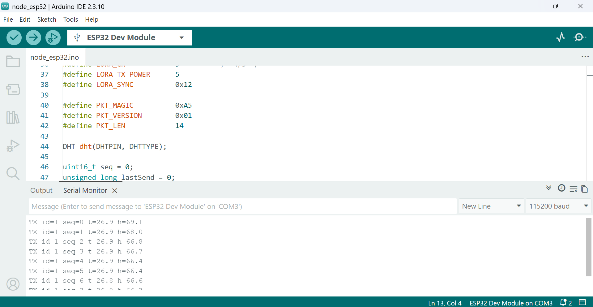
      <br /><sub><b>Nœud 1</b> WROOM-32D, COM3, <code>TX id=1</code></sub>
    </td>
    <td align="center" width="33%">
      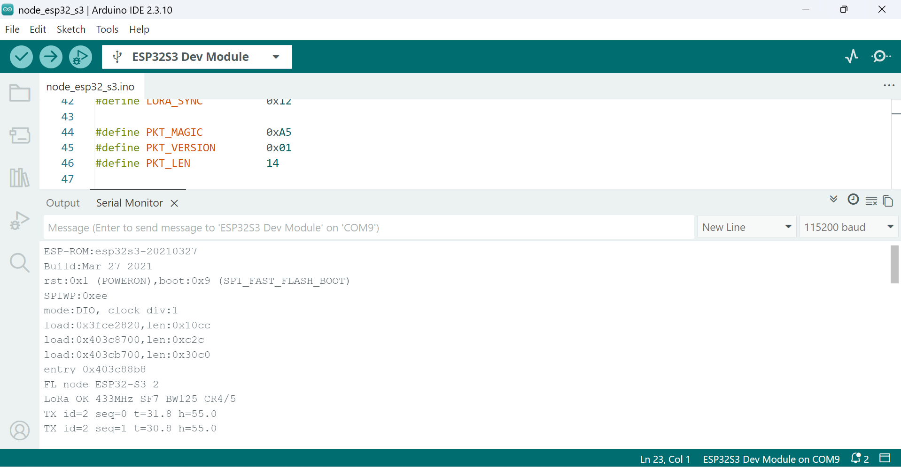
      <br /><sub><b>Nœud 2</b> ESP32-S3, COM9, <code>LoRa OK</code></sub>
    </td>
    <td align="center" width="33%">
      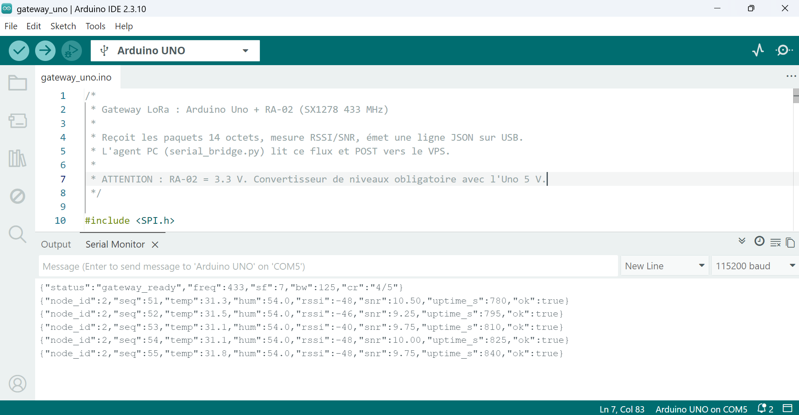
      <br /><sub><b>Gateway</b> Uno, COM5, JSON reçu</sub>
    </td>
  </tr>
</table>

## Démo

Un clic sur le GIF ouvre la vidéo complète (MP4).

<a href="docs/media/demo-dashboard.mp4">
  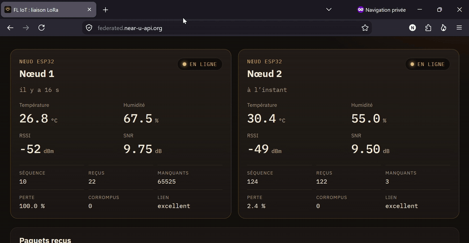
</a>

*Dashboard v1, les deux nœuds en direct. [Vidéo complète (MP4)](docs/media/demo-dashboard.mp4)*

<a href="docs/media/demo-hardware.mp4">
  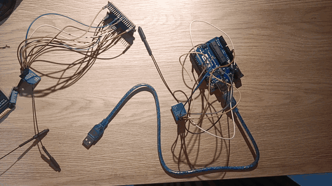
</a>

*Banc câblé : nœuds ESP32, RA-02 et gateway. [Vidéo complète (MP4)](docs/media/demo-hardware.mp4)*

<a href="docs/media/demo-round-fedavg.mp4">
  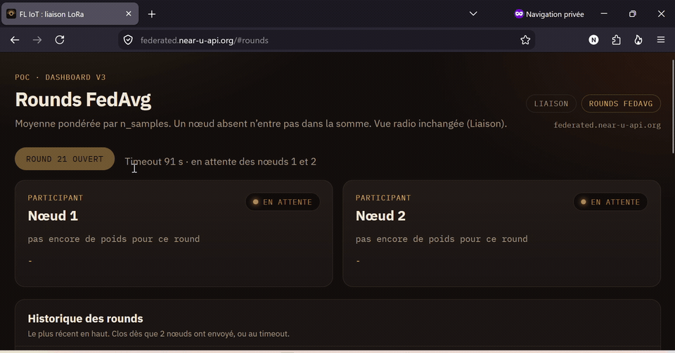
</a>

*Un round FedAvg de bout en bout, **accéléré 3×** (durée réelle ~45 s). Vous verrez sur le terminal l’agent PC, et sur la page web la vue `#rounds`. On y suit : l’émission du `start_round` sur le port série, le nœud 2 qui répond le premier (état « update reçue » tandis que le nœud 1 reste « en attente »), puis la **clôture dès l’arrivée du second nœud**, avec le modèle global inscrit dans l’historique. Le round n’a pas attendu les 90 s de timeout. [Vidéo accélérée (MP4)](docs/media/demo-round-fedavg.mp4) · [vitesse réelle (MP4)](docs/media/demo-round-fedavg-temps-reel.mp4)*

## Couche applicative

| Composant | Rôle |
|-----------|------|
| `agent/serial_bridge.py` | Lit le port COM, POST `/api/ingest` et `/api/fl/update`, relaie `start_round` et le modèle global |
| FastAPI + Uvicorn | Ingest capteur, ingest poids, rounds FedAvg (manuels ou en série), erreur de prédiction, overview, WebSocket `/ws/live` |
| PostgreSQL 16 | `readings`, `node_stats`, `fl_updates`, `fl_rounds` |
| React (Vite) | Cartes nœuds (liaison) ; vue `#rounds` (participants, \(w\) global, RMSE par nœud) |
| Docker / nginx | Reverse proxy. Brancher un domaine personnel ou un tunnel si besoin |

## Structure du dépôt

| Dossier | Rôle |
|---------|------|
| `firmware/` | Nœuds et gateway (cœur IoT) |
| `agent/` | Pont série → HTTP |
| `backend/` | API Python |
| `frontend/` | Dashboard (liaison et rounds) |
| `database/` | Schéma SQL |
| `docker/` | Compose (local ou VPS personnel) |
| `docs/` | Architecture, LoRa, matériel, déploiement, photos |
| `results/` | Exports Postgres des sessions et scripts d’analyse |

## Démarrage rapide

Matériel déjà câblé :

1. Flasher le WROOM (`NODE_ID` 1) et le S3 (`NODE_ID` 2), puis l’Uno.
2. Fermer le Moniteur série de l’Uno (sinon le port COM est occupé).
3. Agent :

```powershell
cd agent
python -m venv .venv
.\.venv\Scripts\Activate.ps1
pip install -r requirements.txt
copy .env.example .env
# INGEST_URL = l'URL de l'API déployée (exemple : http://localhost:8082)
# INGEST_TOKEN = le même que docker/.env
python serial_bridge.py --port COM5
```

Sans matériel, `python simulator.py` envoie des paquets simulés vers l’API.

Déploiement (local ou VPS personnel) : [docs/DEPLOY.md](docs/DEPLOY.md).

## Documentation

| Fichier | Contenu |
|---------|---------|
| [docs/HARDWARE.md](docs/HARDWARE.md) | Broches, couleurs, convertisseur de niveaux |
| [docs/LORA.md](docs/LORA.md) | Format paquet, SF / BW / CR |
| [docs/ARCHITECTURE.md](docs/ARCHITECTURE.md) | Sync vs async, v1 / v2 / v3 |
| [docs/v3/V3_Rapport.md](docs/v3/V3_Rapport.md) | FedAvg, paquets, rounds |
| [docs/v3/V3_Session_inversion.md](docs/v3/V3_Session_inversion.md) | Échange des rôles, pénalité, biais du survivant |
| [docs/DEPLOY.md](docs/DEPLOY.md) | Docker, tunnel optionnel |

## Références

McMahan, H. B., Moore, E., Ramage, D., Hampson, S. et y Arcas, B. A. (2017). Communication-efficient learning of deep networks from decentralized data. In *Proceedings of the 20th International Conference on Artificial Intelligence and Statistics* (AISTATS), PMLR 54, 1273-1282. [http://proceedings.mlr.press/v54/mcmahan17a.html](http://proceedings.mlr.press/v54/mcmahan17a.html)

## Licence

MIT. Projet pédagogique, destiné à la communauté IoT, embarqué et Federated Learning. Le code peut être copié, modifié et redistribué (voir [LICENSE](LICENSE)).
